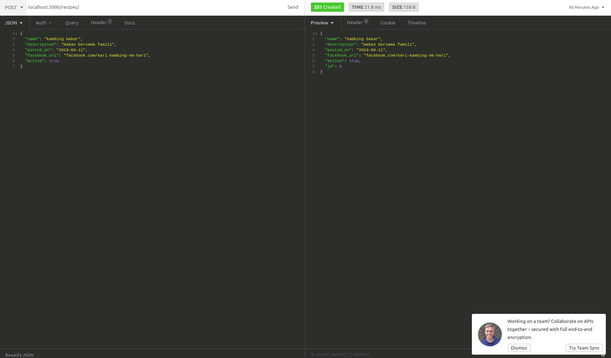

<p align="center">
  <a href="http://nestjs.com/" target="blank"></a>
</p>

[travis-image]: https://api.travis-ci.org/nestjs/nest.svg?branch=master
[travis-url]: https://travis-ci.org/nestjs/nest
[linux-image]: https://img.shields.io/travis/nestjs/nest/master.svg?label=linux
[linux-url]: https://travis-ci.org/nestjs/nest
  
  <p align="center">A progressive <a href="http://nodejs.org" target="blank">Node.js</a> framework for building efficient and scalable server-side applications, heavily inspired by <a href="https://angular.io" target="blank">Angular</a>.</p>
    <p align="center">
<a href="https://www.npmjs.com/~nestjscore"></a>
<a href="https://www.npmjs.com/~nestjscore"></a>
<a href="https://www.npmjs.com/~nestjscore"></a>
<a href="https://travis-ci.org/nestjs/nest"></a>
<a href="https://travis-ci.org/nestjs/nest"></a>
<a href="https://coveralls.io/github/nestjs/nest?branch=master"></a>
<a href="https://gitter.im/nestjs/nestjs?utm_source=badge&utm_medium=badge&utm_campaign=pr-badge&utm_content=body_badge"></a>
<a href="https://opencollective.com/nest#backer"></a>
<a href="https://opencollective.com/nest#sponsor"></a>
  <a href="https://paypal.me/kamilmysliwiec"></a>
  <a href="https://twitter.com/nestframework"></a>
</p>

## Introduction

This Recipe REST API is created for me to learn NestJS and get familiar with it. For this application, I am using MySQL as my database for this project. 

## Run Project

If you have not install Nest, You may run the installation script below. Ensure you have installed NodeJS into your system environment:
```sh
npm i -g @nestjs/cli
```

1. Clone this repository into your directory
2. Cd to the directory
3. Change ownership of your folder to your username, or else you will need root(For UNIX terminals) to install all dependencies
4. Install all required modules:

```sh
npm install
``` 
5. Create your own ormconfig.json in your root project directory
```json
{
        "type": "mysql",
        "host": "your host",
        "port": 3306,
        "username": "your username",
        "password": "your password",
        "database": "db name you created", 
        "entities": ["src/**/*.entity{.ts,.js}"], // if you would like to use npm run start:dev, change src to dist
        "synchronize": true
}
```
6. Run the project
```sh
npm run start or npm run start:dev
```
7. Test the api at localhost:3000/recipes using any 3rd party API tools. Recommended to use Insomnia or Postman and I prefer using Insomnia
8. Star this repo if you find it useful or open pull request if you would like to improve this repo.

#### Screenshot

